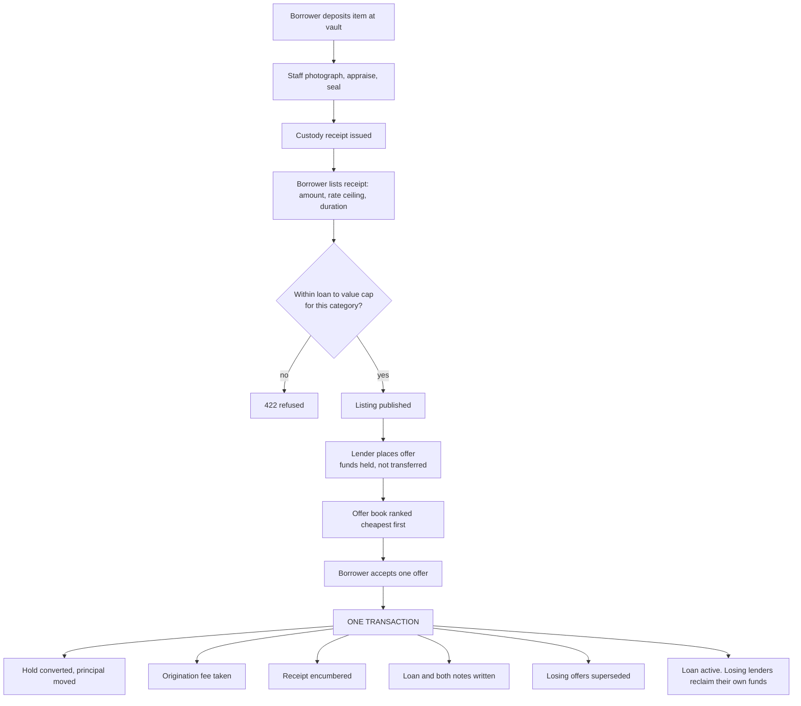
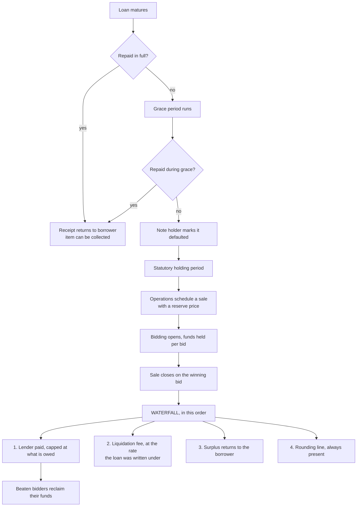
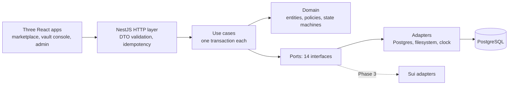

# depawn: how this was built and why

A collateralised lending marketplace for physical items. A borrower deposits something at a vault,
we appraise it and issue a custody receipt, they list that receipt, lenders compete to fund a loan
against it, and on repayment the item goes home. On default it is sold and the proceeds are split.
We are a pawnbroker on modern rails, not a trustless protocol.

## How I planned it

I wrote the specification before the code. Fourteen normative documents came first: domain model,
ledger rules, API contract, flows, testing strategy, phase plan. Then the build ran as an
autonomous loop through phases P0 to P8, one vertical slice at a time.

Two rules did most of the work.

**Vertical slices, not layers.** Each slice finishes one flow end to end (domain, persistence, HTTP,
UI, tests) before the next begins. Building "all the entities" then "all the endpoints" produces a
system that compiles and cannot do anything.

**State lives in files, not in the context window.** `.claude/state/STATE.md` and
`.claude/work/<slice>/{brainstorm,plan,review,verify}.md` mean a session can be killed at any point
and resumed. Every slice ends with a review written by a reviewer that has not seen the
implementation session.

The result is 350 commits, each one green.

## Tools, and why these ones

| Choice | Why |
|---|---|
| **NestJS** | Constructor injection is what makes the port and adapter seam enforceable rather than aspirational. Swapping a Postgres adapter for a Sui one becomes a module change. |
| **PostgreSQL and Prisma** | I need transactions, deferred constraint triggers, and row locks. The ledger invariant is enforced in the database, not only in code. |
| **TypeScript strict, no `any`** | Money is a branded bigint type. The compiler is the first test suite: when I added a category to an enum it listed the fourteen places that had to change. |
| **Vitest, Supertest, Testcontainers, Playwright** | Integration tests run against a real Postgres in a container, never a mock. A mock of a database cannot fail the way a database fails. |
| **fast-check** | Property tests for money arithmetic. The ledger balances for any arrangement of sale, debt and fee, not for the three I thought of. |
| **Turborepo and pnpm workspaces** | Three front ends and one API sharing typed contracts. The contracts package is the only place a request shape is defined. |

## The decisions that mattered

**Money is never a float.** Amounts are bigint minor units with a branded currency, and they cross
the wire as a string. Division truncates in the borrower's favour, deliberately. This caught a real
bug late on: a loan to value chip rendered 21.45 percent as 21.4, because `toFixed` on a float
rounds down a value that is not representable. The fix was integer arithmetic all the way to the
string.

**Double entry, enforced three ways.** Balances are derived with `SUM`, never stored. Every
transaction balances, checked by a domain assertion, a deferred Postgres trigger, and property
tests. Storing a balance means one day it disagrees with the entries and nobody knows which is
right.

**One use case, one transaction.** Every write is a single `unitOfWork.run`. This is not tidiness:
it is what makes each use case translatable to one on chain transaction later. A review found the
protocol parameter edit writing its version and its audit entry in two transactions, which meant a
crash between them could leave an edit nobody could trace. That was a blocking finding.

**Refunds are pull based.** When a lender is outbid, their money is not swept back automatically.
They reclaim it. Nothing moves a person's money without them asking, which is also how it will have
to work on chain.

**Terms travel with the loan.** Rate, duration, maturity, grace and both fees are copied onto the
loan at origination. A reviewer found the liquidation fee was the exception: it was read live at
settlement, so an operator could back date a parameter edit and change what a months old loan paid.
The plan had claimed a test proved this could not happen. The test only covered the origination fee.
That is the single best argument for fresh eyes reviewing every slice.

**Time is a port.** The domain reads a `ClockPort`. Under test it is an in memory offset; in a demo
it is an offset written to the database so the seed and the serving process agree; in production it
is the system clock and the route that would move it is absent from the application graph.

## Key flow: origination

## Key flow: default and liquidation

The surplus going back to the borrower is the difference between a pawnbroker and a repossession.
The rounding line is always computed even when it is zero, because that is what proves the parts sum
to the whole.

## Architecture

The one rule that governs everything: **the domain layer must be identical in Web2 and Web3.** Money,
custody, identity and time reach the domain only through ports. Today they are backed by Postgres.
Later they are backed by Sui. Nothing in `src/domain/` changes. A `dependency-cruiser` check fails
the build if a domain file imports infrastructure, and today zero of them do.

**Stack:** TypeScript, NestJS 11, PostgreSQL 16, Prisma 6, React 19, TanStack Router and Query,
Tailwind with frozen design tokens, Vitest, Supertest, Testcontainers, Playwright, fast-check,
Docker Compose.

## Where AI was used, and how I checked it

Effectively all of the implementation was written by Claude Code working through the pipeline
described above. I directed it, made the product decisions, and reviewed the output. That makes the
verification story the important part, not the fact of AI use.

Five machine gates run before any task is considered done: TypeScript strict, ESLint, formatting,
architectural boundaries, and prose rules. Then unit, integration and end to end suites. Nothing is
committed on a red gate, and no test was ever weakened to pass one.

On top of that, **every slice is reviewed by a fresh agent that did not write the code** and did not
see the session that produced it. It reads the diff against the normative documents and returns
APPROVED or BLOCKED. Several came back BLOCKED, and those findings were the most valuable output of
the whole process:

- A ledger reconciliation check that compared a derived balance against a sum of the same entries.
  It would have passed forever while proving nothing.
- The liquidation fee reaching loans written under an older fee, described above.
- An accessibility audit pointed at `/browse`, a route that does not exist. It was scanning an empty
  page and reporting green on the most important screen in the product.
- A parameter edit whose audit entry was written in a separate transaction.

Tests also caught the AI's own mistakes. An outbox race test proved that `FOR UPDATE SKIP LOCKED`
only reserves rows for the life of a transaction, so a second worker could take the same batch the
moment the first committed. The seed's own test failed because the loan book it produced was dated
ahead of a fresh process's clock.

Where something could not be resolved honestly, it went into `docs/OPEN-QUESTIONS.md` rather than
being guessed. There are 28 entries, each recording what was implemented, what was ambiguous, and
who should decide. The outbox is documented as at least once rather than described as exactly once,
because that is what it is.
